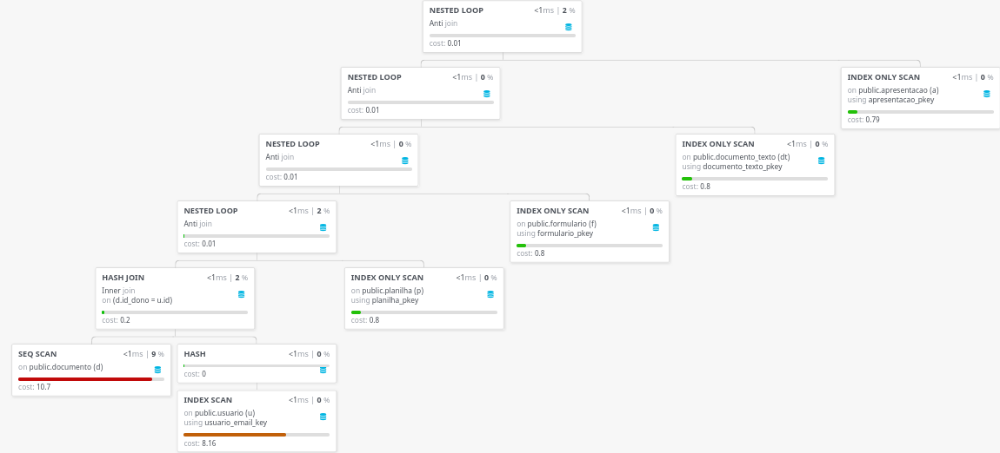

# Comparação entre consultas equivalentes

## Consulta original

```sql
SELECT
    d.id,
    d.tipo,
    d.nome,
    d.descricao
FROM documento d
INNER JOIN usuario u ON d.id_dono = u.id
WHERE u.email = 'willian@email.com'
AND NOT EXISTS (
    SELECT 1
    FROM planilha p
    WHERE p.id_documento = d.id
) AND NOT EXISTS (
    SELECT 1
    FROM formulario f
    WHERE f.id_documento = d.id
) AND NOT EXISTS (
    SELECT 1
    FROM documento_texto dt
    WHERE dt.id_documento = d.id
) AND NOT EXISTS (
    SELECT 1
    FROM apresentacao a
    WHERE a.id_documento = d.id
);
```



## Consulta reescrita

```sql
SELECT
    d.id,
    d.tipo,
    d.nome,
    d.descricao
FROM documento d
INNER JOIN usuario u ON d.id_dono = u.id
LEFT JOIN planilha p ON p.id_documento = d.id
LEFT JOIN formulario f ON f.id_documento = d.id
LEFT JOIN documento_texto dt ON dt.id_documento = d.id
LEFT JOIN apresentacao a ON a.id_documento = d.id
WHERE u.email = 'willian@email.com'
    AND p.id_documento IS NULL
    AND f.id_documento IS NULL
    AND dt.id_documento IS NULL
    AND a.id_documento IS NULL;
```


## Comparação

Surpreendentemente a consulta reescrita teve exatamente o mesmo custo e plano de
execução da consulta original (terceira consulta da parte 1). Isso apenas
comprova que o otimizador reescreve a consulta utilizando álgebra relacional
para fins de otimização.
